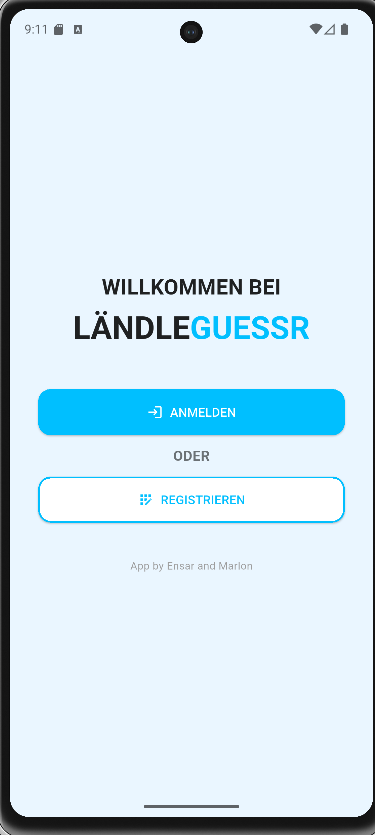
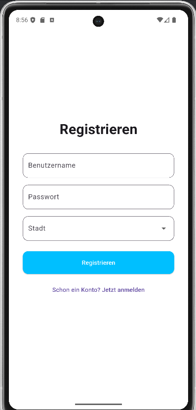
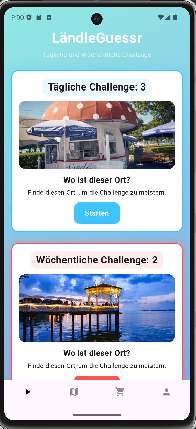
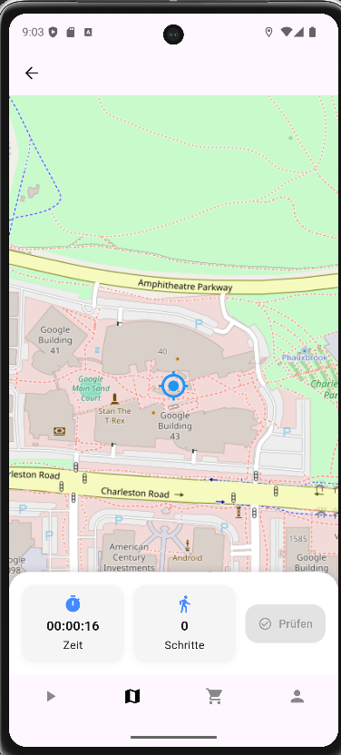
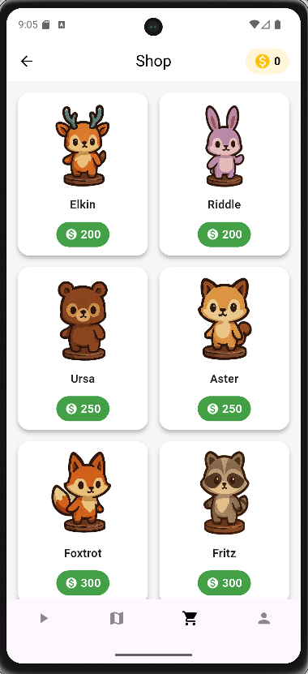
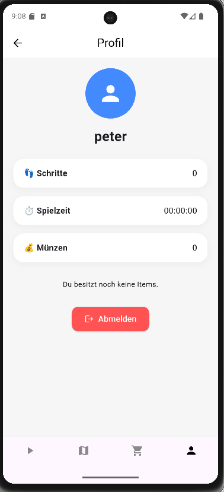

# Bedienungsanleitung

Ansicht nach dem Start des Programms:  
 
Per Klick auf den Button "Anmelden" bzw. "Registrieren" kommt man zu der jeweiligen Page.
 

LoginPage/RegisterPage: 
 
Man muss nun in die Textfelder seine Daten eingeben. Dann kann man mit einem Klick auf den darunter liegenden Button "Registrieren" bzw. "Anmelden".
Beim Registrieren kann man zusätzlich noch seine Heimatstadt mithilfe eines Drop-Down Menüs auswählen (siehe Screenshot unter dem Testfeld "Passwort").
 

MainPage: 
 
Nach dem Anmelden landet man hier. Hier sieht man ganz unten auf dem Screen die Navigationsleiste, welche von nun an immer da sein wird, bis man sich abmeldet.
Zudem sieht man hier die Challenges mit einer Erklärung und einem Bild, welches man finden muss. Mit einem Klick auf "Starten" wird eine Challenge gestartet und man wird auf die MapsPage weitergeleitet.
 
MapsPage: 
 
Wenn KEINE Quest aktiv ist, sieht man hier nur seinen Standort und die Karte selbst. Wenn eine Quest aktiv ist, dann ist im unteren Bereich über der Navigationsleiste eine Schaltfläche zu sehen. Hier ist ersichtlich, wie viele Schritte man bereits gelaufen ist und die Zeit, welche vergangen ist.
Mit einem Klick auf "Prüfen" wird getestet, ob man sich am Zielort der aktiven Quest befindet oder nicht. Falls ja, wird die Challenge abgeschlossen und man kann ab sofort eine neue Quest auf der MainPage starten, sofern noch welche vorhanden sind.
 
ShopPage: 
 
Auf dieser Page landet man, wenn man das dritte Icon von links in der Navigationsleiste klickt. Hier wird der Shop mit allen kaufbaren Items angezeigt. Zudem wird oben links der derzeitige Coin-Stand angezeigt. Mit einem Klick auf die grüne Schaltfläche kann man nun Items erwerben, sofern man genügend Geld hat. Gekaufte Items sind dann nicht mehr kaufbar und werden im Profil angezeigt.
 

ProfilPage: 
 
Auf dieser Page landet man, wenn man das vierte Icon von links in der Navigationsleiste klickt. Hier wird das Profil des Benutzers dargestellt. Es werden die insgesamt über alle Quests verteilten Schritte, die insgesamte Spielzeit und der derzeitige Coins-Stand angezeigt. 
Darunter sieht man im Screenshot ein "Du besitzt noch keine Items.". Hier werden erworbene Items angezeigt, sofern man welche besitzt.
Zudem kann man sich hier noch abmelden.