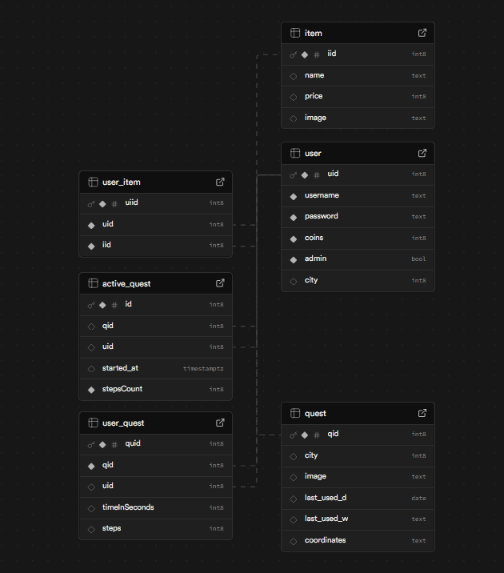

# Pflichtenheft

## POS

### 1 Softwarevorraussetzungen

- Flutter:
    - sdk: flutter
- Packages:
    - flutter_staggered_animations: ^1.1.1
    - cupertino_icons: ^1.0.8
    - shared_preferences: ^2.5.3
    - permission_handler: ^11.0.0
    - flutter_map: ^6.2.1
    - latlong2: ^0.9.0
    - geolocator: ^10.1.0
    - flutter_native_splash: ^2.4.0
    - provider: ^6.1.3
    - pedometer: ^4.0.0
    - http: ^1.2.1

### 2 Architektur

#### 2.1 Klassen

##### 2.1.1 Datenklassen (Schemes)

- Account (abstrakt)
  - Admin
  - User
- City (enum)
  - CityExtension
- Item
- Quest

##### 2.1.2 Manager

- Inventory (quasi ItemManager)
- QuestManager
- UserManager

##### 2.1.3 Controller

- AppController

##### 2.1.4 Services

- APIService
- ItemService
- Locationchecker
- QuestService
- StepCounter
- UserService

##### 2.1.5 Klassenhierarchie

###### 2.1.5.1 Beschreibung

Wir haben uns für folgende Hierarchie entschieden:

- Services, welche von mehreren Stellen im Programm erreichbar sind/benutzt werden
- Datenklassen, welche nur Schemen darstellen und quasi nichts können
- Manager, welche diese Datenklassen verwalten und ihnen die Funktionalität bieten
- Controller (AppController), welcher die Manager verwaltet 

##### 2.1.5.2 Visualisierung im Klassendiagramm

Automatisch generiert mithilfe eines Paketes in flutter.

```uml
@startuml
set namespaceSeparator .

' Vererbung
laendle_guessr.data_objects.account.dart.Account <|-- laendle_guessr.data_objects.admin.dart.Admin
laendle_guessr.data_objects.account.dart.Account <|-- laendle_guessr.data_objects.user.dart.User


' AppController mit Singleton und Aggregationen
class laendle_guessr.controller.appcontroller.dart.AppController {
  {static} -_instance : AppController
  +locationChecker : LocationChecker
  +questManager : QuestManager
  +userManager : UserManager
  {static} +instance : AppController
}
laendle_guessr.controller.appcontroller.dart.AppController o-- laendle_guessr.controller.appcontroller.dart.AppController : singleton
laendle_guessr.controller.appcontroller.dart.AppController o-- laendle_guessr.services.locationchecker.dart.LocationChecker
laendle_guessr.controller.appcontroller.dart.AppController o-- laendle_guessr.manager.questmanager.dart.QuestManager
laendle_guessr.controller.appcontroller.dart.AppController o-- laendle_guessr.manager.usermanager.dart.UserManager

' City als Enum mit statischen Instanzen
class laendle_guessr.data_objects.city.dart.City {
  +index : int
  {static} +values : List<City>
  {static} +bregenz : City
  {static} +dornbirn : City
  {static} +hohenems : City
  {static} +feldkirch : City
  {static} +bludenz : City
}
laendle_guessr.data_objects.city.dart.City o-- laendle_guessr.data_objects.city.dart.City : static values

' Datenobjekte und ihre Beziehungen
class laendle_guessr.data_objects.item.dart.Item {
  +id : int
  +image : String
  +name : String
  +price : int
}

class laendle_guessr.data_objects.quest.dart.Quest {
  +qid : int
  +image : String
  +city : City
  +latitude : double
  +longitude : double
}
laendle_guessr.data_objects.quest.dart.Quest o-- laendle_guessr.data_objects.city.dart.City

class laendle_guessr.data_objects.user.dart.User {
  +coins : int
  +inventory : Inventory
  +city : City
  +activeQuest : Quest?
}
laendle_guessr.data_objects.user.dart.User o-- laendle_guessr.manager.inventory.dart.Inventory
laendle_guessr.data_objects.user.dart.User o-- laendle_guessr.data_objects.city.dart.City
laendle_guessr.data_objects.user.dart.User o-- laendle_guessr.data_objects.quest.dart.Quest

' Inventory & ItemService
class laendle_guessr.manager.inventory.dart.Inventory {
  +items : List<Item>
  +itemService : ItemService
  +addItemToInventory() : void
}
laendle_guessr.manager.inventory.dart.Inventory o-- laendle_guessr.services.item_service.dart.ItemService

' QuestManager mit Singleton und Beziehungen
class laendle_guessr.manager.questmanager.dart.QuestManager {
  {static} -_instance : QuestManager
  +userManager : UserManager
  +weeklyQuest : Quest
  +dailyQuestByCity : Map<City, Quest>
  +timeUntilMidnightNotifier : ValueNotifier
  +questService : QuestService
  +questTimer : Timer?
  +elapsedSeconds : int
  {static} +instance : QuestManager
  +elapsedTime : String
  +isRunning : bool
  +loadQuests() : dynamic
  +dispose() : void
  +getDailyQuestForUser() : Quest?
  +getWeeklyQuest() : Quest
  +getAllQuests() : dynamic
  +getAllDoneQuestsByUser() : dynamic
  +fetchActiveQuest() : dynamic
  +startQuest() : dynamic
  +startTracking() : dynamic
  +startQuestTimer() : void
  +forfeitQuest() : void
  +finishQuest() : void
}
laendle_guessr.manager.questmanager.dart.QuestManager o-- laendle_guessr.manager.questmanager.dart.QuestManager : singleton
laendle_guessr.manager.questmanager.dart.QuestManager o-- laendle_guessr.manager.usermanager.dart.UserManager
laendle_guessr.manager.questmanager.dart.QuestManager o-- laendle_guessr.data_objects.quest.dart.Quest
laendle_guessr.manager.questmanager.dart.QuestManager o-- dart.async.Timer
laendle_guessr.manager.questmanager.dart.QuestManager o-- ValueNotifier
laendle_guessr.manager.questmanager.dart.QuestManager o-- laendle_guessr.services.quest_service.dart.QuestService

' UserManager mit Singleton und Services
class laendle_guessr.manager.usermanager.dart.UserManager {
  {static} -_instance : UserManager
  +apiService : ApiService
  +currentUser : User?
  {static} +instance : UserManager
  +loginUser() : dynamic
  +login() : dynamic
  +logoutUser() : void
}

class ValueNotifier
@enduml
```


#### 2.2 Aufbau der UI

- MainPage, auf welcher die Quests für den angemeldeten User angezeigt werden (Startpunkt der App)
- MapsPage, auf welcher die Map angezeigt wird
- ProfilePage, auf welcher das Profil des Users angezeigt wird
- SignUpPage, auf welcher der User sich registriert
- LoginPage, auf welcher der User sich einloggt
- WillkommenPage, auf welcher der User am Start landet und aussuchen kann, ob er sich anmelden oder registrieren will
    


### 3 Umsetzung der Anforderungen

#### 3.1 Organisatorisch

- zweier Gruppe: Bilal Ensar Bugday, Marlon Pichler
- Arbeit im Unterricht und zubhause (siehe GIT-Repository)

#### 3.2 Technischer Inhalt

##### 3.2.1 Must Haves

- Git Repository aktiv verwendet
  - Immer wieder committet und die Issues aktuell gehalten.
  - Kanban Board genutzt.
- Klassendiagramme vor dem Start der Programmierung
  - Wie per Teams ersichtlich, haben wir bevor wir mit dem Programmieren angefangen haben einen Sketch für die Klassenhierarchie bzw. Klassen gehabt.
- Grafische Anwendung:
  - Wie in Punkt 2.2 ersichtlich haben wir mindestens 3 Pages verwendet.
- Vererbung:
  - Wie in Punkt 2.1.5 ersichtlich haben wir eine abstrakte Klasse verwendet.
- API Dokumentation:
  - Wir haben das komplette FrontEnd mithilfe von KI dokumentiert.
- Unit Tests:
  - Wir haben uns für alle unsere relevanten Klassen Unit Tests geschrieben und damit unsere Klassen getestet

##### 3.2.2 Nice To Haves

- Paralelle Programmierung:
  - Wir haben in unserem Programm oft Datenbankabfragen benutzt und somit auch auf Parallele Programmierung zurückgegriffen.
- Neues Framework bzw. neue Programmiersprache:
  - Wir haben unser Programm in Flutter bzw. Dart umgesetzt. Dies war für uns eine völlig neue und gewöhnungsbedürftige Erfahrung.

#### 3.3 Beschreibung der Anwendung

Erstmal landet der User auf der "WillkommenPage". Auf dieser kann er sich dann entweder anmelden oder sich registrieren und wird auf die jeweilige Page navigiert ("SignUpPage"/"LoginPage").

Wenn er sich nun erfolgreich angemeldet hat kommt der User auf die "MainPage". Unten auf der Page befindet sich in userer gesamten Anwendung ab hier eine NavBar, mit welcher zwischen den Pages gewechselt werden kann. 

So stehen einem nun alle Wege offen. Man kann Quests starten, auf der Map sehen wo man sich gerade befindet, im Shop mit seinen verdienten Coins Sammelstücke erwerben und vieles mehr!

### 4 Mögliche Probleme und ihre Lösung

- Natürlich hat bei unserem Projekt nicht alles auf Anhieb geklappt und wir hatten allfällige Schwierigkeiten. Spezifische Beispiele und deren Lösungen werden hier näher besprochen 

#### 4.1 Automatische Questverteilung

- Speziell bei der Questverteilung hatten wir recht große Schwierigkeiten, welche uns einige Gehirnzellen und Arbeitszeit abverlangt haben.
- Zuerst mussten wir uns hier nämlich überlegen, wie wir denn überhaupt die Quests automatisch verteilen, damit sich die DailyQuests und WeeklyQuests automatisch aktualisieren.
- Nach mehreren Stunden Überlegzeit und Hirnzerbrechen fanden wir dann endlich die Lösung: Cron Jobs
  - Mithilfe von Cron Jobs können in SupaBase nämlich automatisch in bestimmten Intervallen bzw. zu bestimmten Zeiten SQL-Snippets ausgeführt werden
  - Nun mussten wir nur noch das SQL-Snippet erstellen und testen und wir waren Good-To-Go!
        
#### 4.2 Integrieren der Map in das Programm

- Anfangs wollten wir in unserem Programm die Karte von Google Maps verwenden, jedoch machte diese viele Probleme:
  - Die Verwendung dieser Karte ist sehr kompliziert, was uns an sich nicht aufgehalten hätte, ABER:
  - Später ist uns dann aufgefallen, dass die Verwendung mit der Zeit nicht mehr gratis sein würde. Also mussten wir uns eine Alternative suchen
- Diese Alternative war dann OpenStreetMap. Diese war sehr einfach zu bedienen und noch viel wichtiger: vollkommen gratis.
        


## DBI

### 1 Softwarevorraussetzungen

- Python3
- pip
- Pakete:
  - flask
  - connexion
  - supabase-py

### 2 Architektur

- Allgemein war unser Backend so aufgebaut:
  - Frontend (API-Service) -> REST-API -> Supabase-API -> Supabase-Datenbank
- Das Frontend schickt mithilfe des API-Services http-Requests an unsere REST-API, welche dann Anfragen an die Supabase-Api bzw. die Supabase-Datanbank schickt.

#### 2.1 REST-API
- Wir haben für unsere REST-API Swagger (in Python) verwendet und mit "Docker" auf unserem yaml-Schema einen Server generiert.
- In diesem gibt es dann:
  - Controller, welche die Funktionalitäten der Endpunkte darstellen 
  - Und Models, welche von den Controllern benutzt werden
- In den Controllern haben wir wie folgt unterteilt:
  - user_controller.py, dieser managed alle Endpunkte, welche mit Usern zu tun haben
  - item_controller.py, dieser managed alle Endpunkte, welche mit Items zu tun haben
  - quest_controller.py, dieser managed alle Endpunkte, welche mit Quests zu tun haben
  - security_controller.py, dieser managed die Sicherheit unserer REST-API durch beispielsweise Authenticaiton
- In unseren Models gibt es einige Baupläne für Objekte wie beispielsweise:
  - quest_user.py
  - oder user.py

#### 2.2 Datenbank

- Wir haben uns dazu entschieden unsere Datenbank über SupaBase zu erstellen und laufen zu lassen. Dies hatte mehrere Gründe:
  - Sehr einfache Kommunikation zu Programmen
  - Sehr gute Dokumentation
  - Gratis
  - Gutes Scaling
  - ...
- Im Endeffekt sah unsere Datenbankstruktur wie folgt aus:
  - 


### 3 Umsetzung der Anforderungen

#### 3.1 Organisatorisch

- zweier Gruppe: Bilal Ensar Bugday, Marlon Pichler
- Arbeit im Unterricht und zubhause (siehe GIT-Repository)

### 3.2 Technischer Inhalt

#### 3.2.1 Must-Haves

- Mind. 3 Tabellen in 3.NF:
  - Wir haben insgesamt, in welchen wir (hoffentlich) die dritte Normalform beachtet haben.
- Queries mit Select, Joins Aggregation
  - Haben wir alles verwendet (siehe REST-API)
- Schreibender und lesender Zugriff:
  - Wir haben sowohl GET und POST, als auch PUT und DELETE für unsere Vorhaben gebraucht
- mind. 2 Rollen
- SQL-Datenbank:
  - Wir haben eine globale Datenbank verwendet (siehe 2.2)
- REST-Interface:
  - Wir haben mit Swagger (in Python) eine REST-API erstellt (siehe 2.1)
- API-Dokumentation + JSON Schema für Objekte:
  - Wir haben mithilfe von KI eine komplette API-Dokumentation gemacht und haben in unseren Models (siehe 2.1) Schemen erstellt
- Unit Tests:
  - WIr haben Unit Tests für die relevanten Funktionen geschrieben und unsere funktionen damit getestet
- Logging:
  - Wir haben das Projekt komplett geloggt

#### 3.2.2 Nice-To-Haves

- Globale Datenbank (Supabase)

### 3.3 Beschreibung der Anwendung

In unserer REST-API gibt es viele verschiedene Endpunkte, welche alle Daten aus unserer Datenbank auslesen/löschen/verändern/hinzufügen. Diese sind nach Kategorien in Files eingeteilt und auf Funktionalität getestet.

### 4 Mögliche Probleme und ihre Lösung

- Natürlich hat bei unserem Projekt nicht alles auf Anhieb geklappt und wir hatten allfällige Schwierigkeiten. Spezifische Beispiele und deren Lösungen werden hier näher besprochen 

#### 4.1 Supabase

- Trotz der vielen Vorteile gab es bei Supabase für uns trotzdem einige Probleme.
  - Beispielsweise waren die Server von Supabase für mehrere Tage down und wir konnten somit nicht an unserem Backend weiterarbeiten (Blind-Coding ohne testen bringt nichts)
  - Zudem gab es teilweise Diskrepanzen in den Fehlern. An einem Tag kann alles einwandfrei funktionieren und am nächsten Tag funktioniert der 1-zu-1 gleiche Code nicht mehr aufgrund eines Fehlers in SUpabase selbst.
- Lösung gibt es hier keine, außer abzuwarten und Däumchen zu drehen bis die Server wieder laufen

#### 4.2 Rollen

- Da wir zuvor noch nie mit Rollen gearbeitet haben, war es sehr schwer diese umzusetzen und wir sind auf viele Fehler und unerwartetes Verhalten gestoßen
