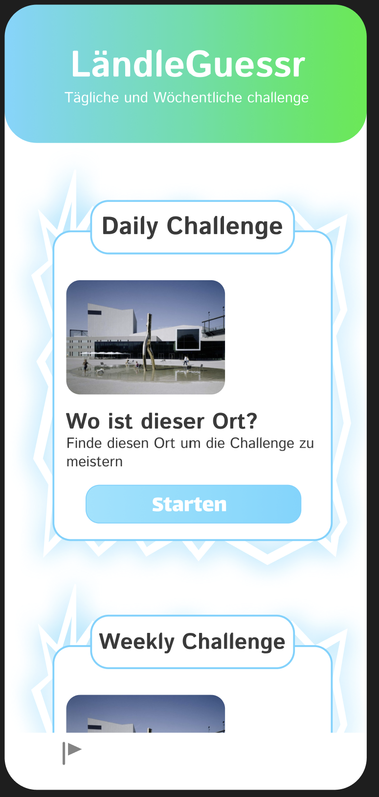

# Projekttitel: LändleGuessr

## Kurzbeschreibung: 
Eine Handy App in welchem man täglich und wöchentlich eine neue Challenge bekommt. Die Challenge ist, dass man ein Bild von einem bestimmten Ort in Vorarlberg bekommt, man muss herausfinden wo das ist und muss dann zu diesem Ort hin, um die Challenge abzuschließen.

## Arbeitseinteilung: 
| Name   | Bereich   | Aufgaben                             |
|--------|-----------|--------------------------------------|
| Ensar  | Backend   | SQL Datenbank, API Dokumentation     |
|        | Frontend  | User Profile, App UI Design, Login, Bilder aus Bregenz |
| Marlon | Backend   | REST Interface, Unit Tests, Logging  |
|        | Frontend  | GPS-Tracking, Maps, Belohnungen        |

## Softwarekonzept

siehe PDF

## Was wir bisher erreicht haben

### UI-Design

